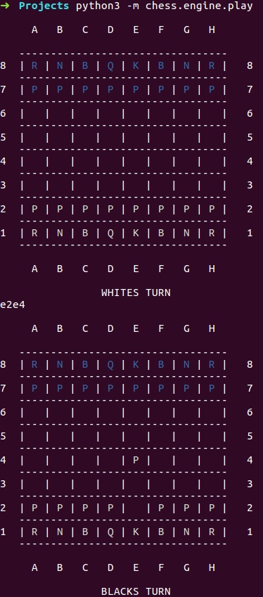

# Chess Engine

## Description

This chess engine allows you to play with a human in a linux shell.

Supported moves :
 - All pieces moves.
 - Castling.
 - "En Passant".
 - Promotion as queen.

The program ends when the game is over.

Supported ends :
 - Checkmate.
 - Slatemate.
 - Fifty moves rule.
 - Threefold repetitions rule.

The engine has been tested on 6k games, from Lichess Data Set.

## How to run it ?

From the folder containing the "chess" folder, run in shell :

- python -m chess.engine.play

Each move must be typed in the shell.
It is executed by the engine if it is valid.

Exemple :

## Requirements

- Python 3.5.2
- Numpy

# Chess AI

## Description

This chess AI has been developped according to Alpha Zero algorithm.
Information about algorithm mechanism are well detailled in [DeepMind's original paper](https://www.nature.com/articles/nature24270.epdf?author_access_token=VJXbVjaSHxFoctQQ4p2k4tRgN0jAjWel9jnR3ZoTv0PVW4gB86EEpGqTRDtpIz-2rmo8-KG06gqVobU5NSCFeHILHcVFUeMsbvwS-lxjqQGg98faovwjxeTUgZAUMnRQ).
Based on deep reinforcement learning, it combines Monte Carlo Tree Search with a convolutional neural network.
My neural network is smaller than Alpha Zero's one, and does not use residual network.
It has not been trained yet due to a lack of computation power.

## How to run it ?

From the folder containing the "chess" folder, type in shell :

- python -m chess.bot.train

As my engine was not designed for, if you do want to train it, I recommend to use [this chess engine](https://github.com/niklasf/python-chess), which is free and strongly optimized.

## Requirements

- Python 3.5.2
- Numpy
- Keras
- Tensorflow
- Colorama (on Windows)

## TODO LIST

- Train the model with a consequent number of games.
- Parameter tunning.
- Implement an Alpha-Beta Pruning and compare both AI. 
